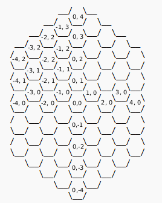

# Definition of cells
One cell is

```
 __
/  \
\__/
```

Two cells

```
 __
/  \__
\__/  \
   \__/
```

Three cells 

```
 __    __
/  \__/  \
\__/  \__/
   \__/
```

## Row / line definitions

One line

```
             __    __    __    __
          __/  \__/  \__/  \__/  \__
         /  \__/  \__/  \__/  \__/  \
         \__/  \__/  \__/  \__/  \__/
```

Two lines

```
             __    __    __    __
          __/  \__/  \__/  \__/  \__
         /  \__/  \__/  \__/  \__/  \
         \__/  \__/  \__/  \__/  \__/
         /  \__/  \__/  \__/  \__/  \
         \__/  \__/  \__/  \__/  \__/
```

## Coordinates calculation
Every shapes the origin point is in middle of the shape.
Here is an example of coordinates.



# Shapes
## Explanations

To display my shapes in the terminal, I will follow previous definitions.
To produce it I will need to display based axial or offset views.
Example, an hexagon will use axial display, it prevent to display a shape like that:

```
        • • • • •
      • • • • • •
    • • • • • • •
  • • • • • • • •
• • • • • • • • •
• • • • • • • •
• • • • • • •
• • • • • •
• • • • •
```

## Hexagon

Size = 5
> Definition of size is the length of every side should be 5 cells.

```
                      __
                   __/  \__
                __/  \__/  \__
             __/  \__/  \__/  \__
          __/  \__/  \__/  \__/  \__
         /  \__/  \__/  \__/  \__/  \
         \__/  \__/  \__/  \__/  \__/
         /  \__/  \__/  \__/  \__/  \
         \__/  \__/  \__/  \__/  \__/
         /  \__/  \__/  \__/  \__/  \
         \__/  \__/  \__/  \__/  \__/
         /  \__/  \__/  \__/  \__/  \
         \__/  \__/  \__/  \__/  \__/
         /  \__/  \__/  \__/  \__/  \
         \__/  \__/  \__/  \__/  \__/
            \__/  \__/  \__/  \__/
               \__/  \__/  \__/
                  \__/  \__/
                     \__/
```

## Rectangle 

height = 3 
width = 9

```
             __    __    __    __
          __/  \__/  \__/  \__/  \__
         /  \__/  \__/  \__/  \__/  \
         \__/  \__/  \__/  \__/  \__/
         /  \__/  \__/  \__/  \__/  \
         \__/  \__/  \__/  \__/  \__/
         /  \__/  \__/  \__/  \__/  \
         \__/  \__/  \__/  \__/  \__/
```

# Diamond

size = 5

> In diamond shape, 5 is the radius from the middle

```
          __    __    __    __
         /  \__/  \__/  \__/  \
         \__/  \__/  \__/  \__/
       __/  \__/  \__/  \__/  \__
    __/  \__/  \__/  \__/  \__/  \__
   /  \__/  \__/  \__/  \__/  \__/  \
   \__/  \__/  \__/  \__/  \__/  \__/
 __/  \__/  \__/  \__/  \__/  \__/  \__
/  \__/  \__/  \__/  \__/  \__/  \__/  \
\__/  \__/  \__/  \__/  \__/  \__/  \__/
   \__/  \__/  \__/  \__/  \__/  \__/
      \__/  \__/  \__/  \__/  \__/
      /  \__/  \__/  \__/  \__/  \
      \__/  \__/  \__/  \__/  \__/
         \__/  \__/  \__/  \__/
            \__/  \__/  \__/
            /  \__/  \__/  \
            \__/  \__/  \__/
               \__/  \__/
                  \__/
                  /  \
                  \__/
```

## Triangle equilateral

**/!\ TODO /!\\**

size = 4
> Definition of size is the length of every side should be 5 cells.

```
                   __                                                                         
                  /  \                                                                        
                  \__/                                                                        
                __/  \__                                                                      
               /  \__/  \                                                                     
               \__/  \__/                                                                     
             __/  \__/  \__                                                                   
            /  \__/  \__/  \                                                                  
            \__/  \__/  \__/                                                                  
          __/  \__/  \__/  \__                                                                
         /  \__/  \__/  \__/  \                                                               
         \__/  \__/  \__/  \__/
```

# Triangle right

height = 5
width = 9
> Height corresponds to the number of columns and the width to the longest row, in this case the base.

```
          __                                                                                  
         /  \__                                                                               
         \__/  \__                                                                            
         /  \__/  \__                                                                         
         \__/  \__/  \__                                                                      
         /  \__/  \__/  \__                                                                   
         \__/  \__/  \__/  \__                                                                
         /  \__/  \__/  \__/  \__                                                             
         \__/  \__/  \__/  \__/  \__                                                          
         /  \__/  \__/  \__/  \__/  \                                                         
         \__/  \__/  \__/  \__/  \__/  
```